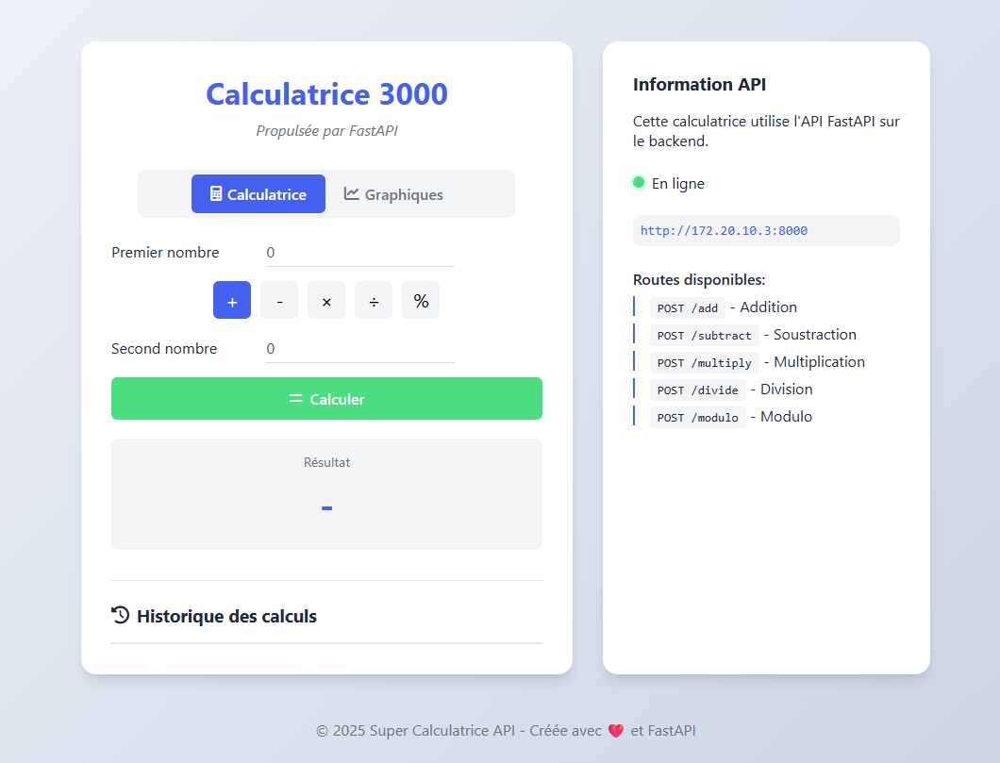
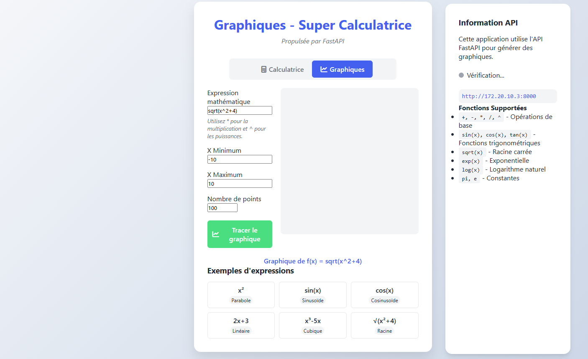

Une application web de calculatrice et de génération de graphiques utilisant FastAPI et JavaScript.

## Fonctionnalités

- Calculatrice basique (addition, soustraction, multiplication, division, modulo)
- Générateur de graphiques pour fonctions mathématiques
- Interface utilisateur intuitive
- API RESTful complète

## Technologies utilisées

- Backend : FastAPI, Python, NumPy
- Frontend : HTML, CSS, JavaScript, Chart.js
- Tests : pytest

## Installation

### Prérequis
- Docker
- Python 3.11+

### Installation avec Docker

```docker build -t calculator-api
docker run -d -p 8000:8000 --name calculator-api calculator-api```


### Utilisation en local
Ouvrez index.html dans votre navigateur.

## Captures d'écran




## Licence

MIT